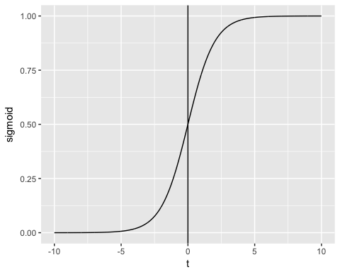

```{r setup, include=FALSE, echo=FALSE}
knitr::opts_chunk$set(fig.width=5, fig.height=4) 

if(!require(tidyverse)) install.packages("tidyverse", repos = "http://cran.us.r-project.org")
if(!require(caret)) install.packages("caret", repos = "http://cran.us.r-project.org")
if(!require(data.table)) install.packages("data.table", repos = "http://cran.us.r-project.org")
if(!require(ggplot2)) install.packages("data.table", repos = "http://cran.us.r-project.org")
if(!require(recosystem)) install.packages("recosystem", repos = "http://cran.us.r-project.org")
if(!require(corrplot)) install.packages("corrplot", repos = "http://cran.us.r-project.org")
if(!require(scales)) install.packages("scales", repos = "http://cran.us.r-project.org")
if(!require(lemon)) install.packages("lemon", repos = "http://cran.us.r-project.org")
if(!require(kableExtra)) install.packages("kableExtra", repos = "http://cran.us.r-project.org")
if(!require(rattle)) install.packages("rattle", repos = "http://cran.us.r-project.org")

library(rattle)
library(kableExtra)
library(scales)
library(corrplot)
library(recosystem)
library(tidyverse)
library(caret)
library(data.table)
library(ggplot2)
library(lemon)
knit_print.data.frame <- lemon_print

## Loading dataset
df <- read_csv("./Breast_Cancer.csv")
colnames(df) <- make.names(colnames(df))
```

\newpage

# **Introduction**

As the science and medical abilities increase from a year to another, it becomes important to have a better understanding of diseases. In the United States, one in three people will develop a cancer in their lifetime which is a significant proportion of the population so it should be a major forcus to know how to deal with it.

I decided to work on a set that contains many cancer indicators and the issue that I am going to try to predict : Did the patient survived ?

\newpage

# **Preparing the environment**

## Load and divide dataset

The first step of this project is to oad the libraries and the data then to split it into a main and validation set.

I downloaded the data from the following link on Kaggle : <https://www.kaggle.com/datasets/reihanenamdari/breast-cancer>

As the data does not contain a lot of observations (4024), I decided to split it to have a validation set representing 10% of the total dataset. This allow us to keep a good number of observations to train and choose the models that will be used to predict the status of a patient.

To do so, I used the **createDataPartition** of the caret package :

```{r split}
trainIndex <- createDataPartition(df$Status, p = 0.9, list = FALSE, times = 1)
validation  <- df[-trainIndex,]
df <- df[ trainIndex,]
```

So now df reprensents the main dataset that will be used to study it and build our model.

## Clean and transform

As there were no null values in this dataset, I did not have to delete or replace some values.

However there are many non numerical values so I checked the number of unique values per column.

```{r uniqueV,fig.align='center', echo=FALSE}
kable(as.data.frame(apply(df, 2, function(x) length(unique(x)))), col.names = c( "Unique values"),caption = "Number of unique values per columns") %>%
  kable_styling(latex_options = "hold_position")
```


We can observe that most of the non numerical columns have only a few unique values so I decided to keep the original version of df (***df_original***) and transform df into all numerical predictors by transforming them into factors then numerical.

```{r transform}
df_original <- df
df <- as.data.frame(apply(df, 2, function(x) ifelse(x == "numeric", x, as.numeric(as.factor(x)))))
```

\newpage

# **Exploratory Data Analysis**

## Proportion based on status

I first started to check how many people survived the cancer by calculating the proportion of person alive which is **0.847** and by doing the following simple plot :

```{r deadOrAlive,fig.align='center', echo=FALSE}
df_original %>% ggplot(aes(Status, fill=Status)) + geom_bar() + theme_minimal() +
  scale_fill_manual(values=c("deepskyblue3", "red3"))
```

## Correlation matrix

To get which predictors are the main ones and which variable has the most influence of the status and the chances of surviving of someone, I realized a correlation plot. 

```{r corrplot,fig.align='center', echo=FALSE}
# Correlation plot
cor <- cor(df)
colnames(cor) <- c("Age", "Race", "Marital", "T.Stage", "N.Stage", "6th.Stage", "Differentiate", "Grade", "A.Stage",
                   "T Size", "Estrogen", "Progesterone", "Node Exam", "Node +", "Survaval M", "Status")
corrplot(cor, addCoef.col = 1, number.cex = 0.5 ) 

```

As we can observe, some variables like the marital status, the race, the age or the differentiation have almost no impact on the status so we'll see later that we can remove them from our data frame to obtain the best accuracy. 

## Impact of T.Stage

One of the parameter that is often used to describe a cancer and understand its gravity is the stage. There are four stages : 
- **1 : Early Stage** 
  - The tumour is small 
  - Localized
- **2 : Localized**
  - Larger than stage 1
- **3 : Regional Spread**
  - Surrounding tissues are affected
  - Lymph nodes
  - Tumor has grown
- **4 : Distant Spread**
  - Spreaded more than original location
  - Matastases

As it is one of the first thing that is found and told to the patient, I thought that is was important to verify how much the impact is important. 


```{r TStage,fig.align='center', echo=FALSE}
# T.Stage
df_original %>% group_by(T.Stage) %>% 
  summarize(Alive = sum(Status=="Alive"), Dead = sum(Status=="Dead"), Total = Alive+Dead) %>% 
  arrange(T.Stage) %>% pivot_longer(cols = c(Dead, Alive), values_to = "N", names_to = "Status") %>%
  ggplot(aes(x=0, y=N, fill=Status, group=Status)) + 
  geom_bar(stat = "identity", position="fill") +
  geom_text(aes(label = percent(N/Total)), position = position_fill(vjust = 0.5)) +
  coord_polar(theta = "y") +
  facet_wrap(.~ T.Stage) +
  theme(axis.text = element_blank(),
        axis.ticks = element_blank(),
        panel.grid  = element_blank()) +
  scale_fill_manual(values=c("deepskyblue3", "red3"))
```

We can see that the percentage of people that did not survive increases a lot as the stage is advanced which is not surprising.

## Survival Months

On the correlation matrix we saw that the predictor that has the more influence is the survival months predictor. We can tell from the following plot that if the survival months increase, the chances of not dying from cancer increases too. This mostly depends on when does the person was taken in consideration in the study that is at the origin of this dataset. 

```{r survivalMonths,fig.align='center', echo=FALSE}
# Survival.Months
df_original %>% group_by(Survival.Months) %>% select(Status) %>%
  summarize(Alive = sum(Status=="Alive"), Dead = sum(Status=="Dead")) %>% 
  arrange(Survival.Months) %>% pivot_longer(cols = c(Dead, Alive), values_to = "N", names_to = "Status") %>%
  ggplot(aes(x=Survival.Months,y=N, fill=Status)) +
  geom_bar(stat = "identity", position="fill") + 
  scale_fill_manual(values=c("deepskyblue3", "red3"))
```


# **Predictions**

Now, I am going to split my main dataset ***df*** into a test and train model to try many models and at the end choose which one is the best. As we're dealing with medical and life/death situation, and taking into account that the dataset is quite small, my goal is to reach an accuracy over 85% with those train and test set and around 80% with validation set. 

```{r splitDF}
set.seed(1, sample.kind="Rounding") 
colnames(df) <- make.names(colnames(df))
trainIndex <- createDataPartition(df$Status, p = 0.85, list = FALSE, times = 1)
train_set <- df[ trainIndex,]
test_set  <- df[-trainIndex,]
```

For the models, I mostly used the **caret** package.

For every model I tried to predict the outcome by using all the predictors and by using only the ones with the most impact to then compare which method is the best.

## KNN (K-Nearest Neighbors)

This supervised machine learning algorithm useful in classification predictions as we have here. 
KNN is mostly used for classification as it classifies the data point on how its neighbor is classified. Which means that the new data points are classified based on the similarity measure of the earlier stored data points. 

I chose k by taking the closest odd number after the square root of the number of variables.

```{r knn}
fit_knn <- train(as.factor(Status) ~ .,  method = "knn", 
                 tuneGrid = data.frame(k = 5), 
                 data = train_set)
predict_knn_all <- predict(fit_knn, newdata = test_set)
acc_all <- sum(predict_knn_all==test_set$Status)/nrow(test_set)

fit_knn <- train(as.factor(Status) ~ Survival.Months + Reginol.Node.Positive + T.Stage + N.Stage + Estrogen.Status + X6th.Stage + Progesterone.Status,  method = "knn", 
                 tuneGrid = data.frame(k = 3), 
                 data = train_set)
predict_knn <- predict(fit_knn, newdata = test_set)
acc_few <- sum(predict_knn==test_set$Status)/nrow(test_set)

accuracy_results <- tibble(method = "KNN Accuracy", Accuracy_All = acc_all, Accuracy_Part = acc_few)
```

```{r acc_knn,fig.align='center', echo=FALSE}
cat("KNN Accuracy (with 7 predictors) : ", acc_few)
cat("KNN Accuracy (with all predictors) : ", acc_all)
```

## Random forest

To apply this algorithm, I used caret package with the *rf* method and also with the *Rborist* method which do the same process but faster by applying it differently on the system side.

At the end off each method, I add the results to the result table named ***accuracy_results***.

```{r rborist,fig.align='center', echo=FALSE}
#With all the predictors
fit_rborist <- train(as.factor(Status) ~  .,
                     method = "Rborist",
                     tuneGrid = data.frame(predFixed = 2, minNode = 3),
                     data = train_set)
predict_rborist_all <- predict(fit_rborist, newdata = test_set)
acc_all_rborist <- sum(predict_rborist_all==test_set$Status)/nrow(test_set)

# With only a few predictors
fit_rborist <- train(as.factor(Status) ~  Survival.Months + Reginol.Node.Positive + T.Stage + N.Stage + Estrogen.Status + X6th.Stage + Progesterone.Status,
                     method = "Rborist",
                     tuneGrid = data.frame(predFixed = 2, minNode = 3),
                     data = train_set)
predict_rborist <- predict(fit_rborist, newdata = test_set)
acc_few_rborist <- sum(predict_rborist==test_set$Status)/nrow(test_set)

accuracy_results <- bind_rows(accuracy_results,
                              tibble(method="RBorist",
                                     Accuracy_All = acc_all_rborist, Accuracy_Part= acc_few_rborist)) 
```

```{r acc_rborist,fig.align='center', echo=FALSE}
cat("RBorist Accuracy (with 7 predictors) : ", acc_few_rborist)
cat("RBorist Accuracy (with all predictors) : ", acc_all_rborist)
```

```{r rf}
# Random forest
#With all the predictors
fit_rf <- train(as.factor(Status) ~  .,
                data=train_set,
                method = "rf", trControl=trainControl(method="cv", number=5))
predict_rf_all <- predict(fit_rf, newdata = test_set)
acc_all_rf <- sum(predict_rf_all==test_set$Status)/nrow(test_set)

# With only a few predictors
fit_rf <- train(as.factor(Status) ~  Survival.Months + Reginol.Node.Positive + T.Stage + N.Stage + Estrogen.Status + X6th.Stage + Progesterone.Status,
                     data=train_set,
                     method = "rf", trControl=trainControl(method="cv", number=5))
predict_rf <- predict(fit_rf, newdata = test_set)
acc_few_rf <- sum(predict_rf==test_set$Status)/nrow(test_set)

accuracy_results <- bind_rows(accuracy_results,
                              tibble(method="Random Forest",
                                     Accuracy_All = acc_all_rf, Accuracy_Part = acc_few_rf)) 
```

```{r acc_rf,fig.align='center', echo=FALSE}
cat("Rf Accuracy (with 7 predictors) : ", acc_few_rf)
cat("Rf Accuracy (with all predictors) : ", acc_all_rf)
```

## Generalized Linear Model

We know that linear regression is not the most powerful algorithm for classification models so I decided to use the generalized linear model that is based on a function that will give a discrete output and that looks like this : 

By using a code similar to what was done before, I obtained the following results : 

```{r acc_glm,fig.align='center', echo=FALSE}
#With all the predictors
fit_glm <- train(as.factor(Status) ~ ., data=train_set,
                    method='glm')
predict_glm_all <- predict(fit_glm, newdata = test_set)
acc_all_glm <- sum(predict_glm_all==test_set$Status)/nrow(test_set)

# With only a few predictors
fit_glm <- train(as.factor(Status) ~ Survival.Months + Reginol.Node.Positive + T.Stage + N.Stage + Estrogen.Status + X6th.Stage + Progesterone.Status
                 , data=train_set,
                 method='glm')
predict_glm <- predict(fit_glm, newdata = test_set)
acc_few_glm <- sum(predict_glm==test_set$Status)/nrow(test_set)

accuracy_results <- bind_rows(accuracy_results,
                              tibble(method="GLM",
                                     Accuracy_All = acc_all_glm, Accuracy_Part = acc_few_glm)) 
cat("Rf Accuracy (with 7 predictors) : ", acc_few_glm)
cat("Rf Accuracy (with all predictors) : ", acc_all_glm)
```

## RPart

The *Rpart* method stands for Recursive Partitioning and Regression Trees. 

By using all the predictors, I obtained this classification tree : 

```{r rpart,fig.align='center', echo=FALSE}
#With all the predictors
fit_rpart <- train(as.factor(Status) ~  ., data = train_set,
                     method = "rpart")
predict_rpart_all <- predict(fit_rpart, newdata = test_set)
acc_all_rpart <- sum(predict_rpart_all==test_set$Status)/nrow(test_set)

fancyRpartPlot(fit_rpart$finalModel)

# With only a few predictors
fit_rpart <- train(as.factor(Status) ~ Survival.Months + Reginol.Node.Positive + T.Stage + N.Stage + Estrogen.Status + X6th.Stage + Progesterone.Status,
                   data = train_set,
                   method = "rpart")
predict_rpart <- predict(fit_rpart, newdata = test_set)
acc_few_rpart <- sum(predict_rpart==test_set$Status)/nrow(test_set)

accuracy_results <- bind_rows(accuracy_results,
                              tibble(method="RPart",
                                     Accuracy_All = acc_all_rpart, Accuracy_Part = acc_few_rpart)) 
```

Those are the obtained accuracies : 

```{r acc_rpart,fig.align='center', echo=FALSE}
cat("Rf Accuracy (with 7 predictors) : ", acc_few_rpart)
cat("Rf Accuracy (with all predictors) : ", acc_all_rpart)
```

## Combining methods

Finally, I decided to try to combine the methods so that it will classify the output depending on what is predicted by the majority of the previous algorithms.

```{r combined_all}
# Creating a dataframe with all the previous predictions
pfinal <- tibble(predict_knn = as.numeric(predict_knn_all),
                 predict_rborist = as.numeric(predict_rborist_all),
                 predict_rf = as.numeric(predict_rf_all),
                 predict_glm = as.numeric(predict_glm_all),
                 predict_rpart = as.numeric(predict_rpart_all))

# Choose the predicted outcome depending on the majority
prediction_combined <- ifelse(rowSums(pfinal)>7, 2, 1)

# Compute accuracy
acc_all_combined <- sum(prediction_combined==test_set$Status)/nrow(test_set)
```


```{r combined_few,fig.align='center', echo=FALSE}
pfinal <- tibble(predict_knn = as.numeric(predict_knn),
                 predict_rborist = as.numeric(predict_rborist),
                 predict_rf = as.numeric(predict_rf),
                 predict_glm = as.numeric(predict_glm),
                 predict_rpart = as.numeric(predict_rpart))

prediction_combined <- ifelse(rowSums(pfinal)>7, 2, 1)
acc_few_combined <- sum(prediction_combined==test_set$Status)/nrow(test_set)

accuracy_results <- bind_rows(accuracy_results,
                              tibble(method="Combined",
                                     Accuracy_All = acc_all_combined, Accuracy_Part = acc_few_combined)) 

```

\newpage

# **Results**

After testing all the different algorithms, we have this final results table : 

```{r res,fig.align='center', echo=FALSE}
kable(accuracy_results, caption = "Accuracy of every tested machine learning algorithm/ method") %>%
  kable_styling(latex_options = "hold_position")
```

We can observe that the best accuracy is obtained with the Random forest method so I chose to apply it with the validation set.

First we transform the validation set so that it becomes only numerical like our *df* and then I applied the random forest method : 

```{r predict_final}
# Validation set transformation
validation <- as.data.frame(apply(validation, 2, function(x) ifelse(x == "numeric", x, as.numeric(as.factor(x)))))

# Random Forest model
fit_final <- train(as.factor(Status) ~  .,
                data=df,
                method = "rf", trControl=trainControl(method="cv", number=5))
predict_final <- predict(fit_final, newdata = validation)
acc_final <- sum(predict_final==validation$Status)/nrow(validation)
```

The accuracy on the validation set is : 
```{r final_acc, echo=FALSE}
acc_final
```

\newpage

# **Conclusion**


During this final project, I observed that all the classification models gave a similar accuracy th less than 0.3 maximum difference. I also think that the accuracy could be improved with a bigger dataset and that we could probably reach a 90% or more accuracy which will be very useful in medical procedures to analyze the cancer and its level of danger for the life of the patient.

I wanted to thank HarvardX and edX for this course that improved my skills in R by taking some real life examples and applications to make everyone realize the importance of data and data science in our world. 


